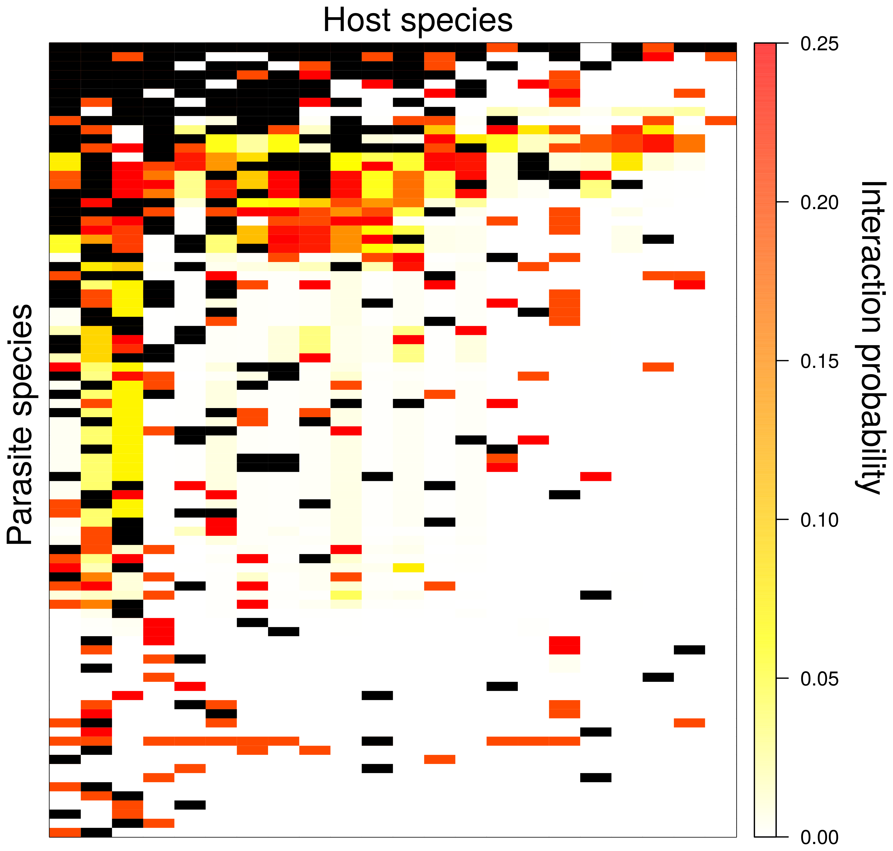
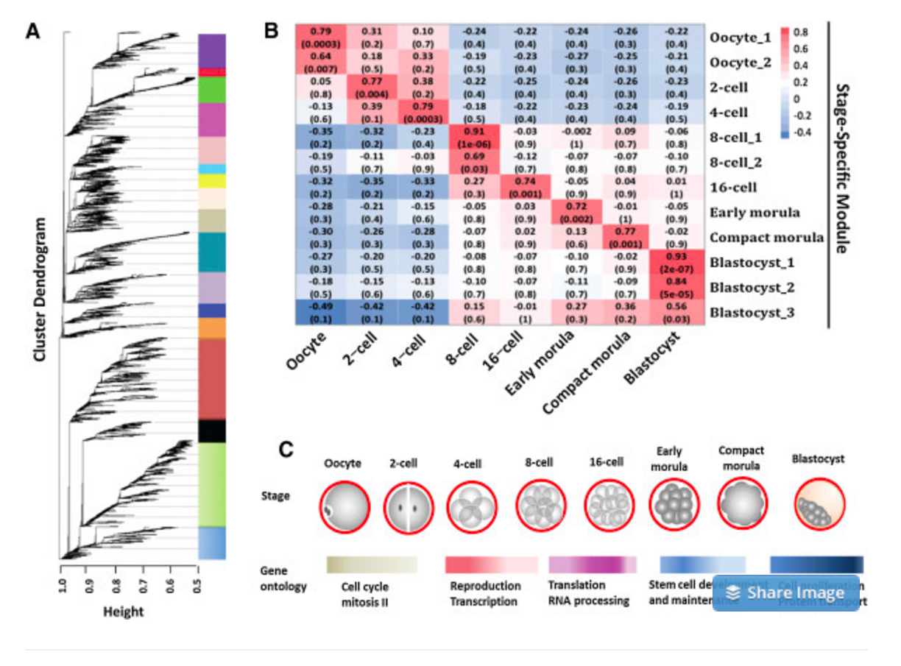
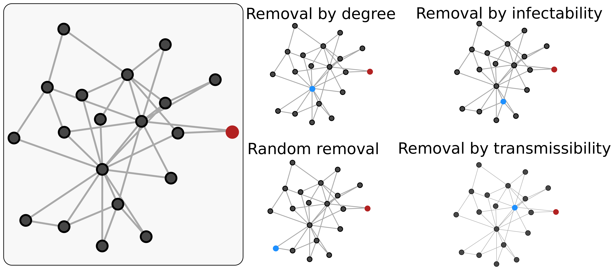

# Networks

```{r}
library(igraph)
plot(barabasi.game(10, m=2, directed=FALSE),
	vertex.color='dodgerblue')
```


## Types of networks

Social networks 

Gene reg or expression networks

Transportation networks

Computer networks

Ecological networks (host-parasite, plant-pollinator)

Movie-actor networks

Spatial networks 

...any interaction, flow, or association 


## Directed/undirected

```{r}

par(layout(matrix(1:2, ncol=2)), mar=c(3,0,0,0))
plot(barabasi.game(10, m=2, directed=TRUE),
	vertex.color='dodgerblue', vertex.labels=NA)
plot(barabasi.game(10, m=2, directed=FALSE),
	vertex.color='firebrick', vertex.labels=NA)

```


## Weighted/unweighted

```{r, echo=FALSE}

g <- barabasi.game(10, m=2, directed=FALSE)
lay <- layout_nicely(g)
par(layout(matrix(1:2, ncol=2)), mar=c(3,0,0,0))
plot(g, vertex.color='dodgerblue', layout=lay, vertex.label=NA)

E(g)$weight <- sample(1:8, length(E(g)), replace=TRUE)
plot(g, vertex.color='dodgerblue', layout=lay, vertex.label=NA, edge.width = E(g)$weight)

```


## Unipartite/bipartite


```{r, echo=FALSE}

g <- barabasi.game(10, m=2, directed=FALSE)
par(layout(matrix(1:2, ncol=2)), mar=c(3,0,0,0))
plot(g, vertex.color='dodgerblue', vertex.label=NA)

g2 <- sample_bipartite(10, 5, p=0.6)
col <- c("dodgerblue", "orange")
shape <- c("circle", "square")

box()
plot(g2, vertex.label=NA, 
  vertex.color = col[as.numeric(V(g2)$type)+1],
  vertex.shape = shape[as.numeric(V(g2)$type)+1])
box()

```


## Network visualization

```{r, echo=FALSE}

g <- barabasi.game(10, m=2, directed=FALSE)
E(g)$weight <- sample(1:8, length(E(g)), replace=TRUE)
par(layout(matrix(1:2, ncol=2)), mar=c(3,0,4,4))
plot(g, vertex.color='dodgerblue', edge.width = E(g)$weight)
image(as.matrix(get.adjacency(g, attr='weight')), axes=FALSE)
box()
axis(1, at=seq(0,1, length.out=10), labels=1:10)
axis(2, at=seq(0,1, length.out=10), labels=1:10, las=1)

```


## Network-level measures

**Nestedness**:

Tendency of interactions to form proper subsets of interactions

```{r, echo=FALSE}
library(metacom)
data(TestMatrices)
par(layout(matrix(1:2, ncol=2)), mar=c(3,0,4,4))
image(TestMatrices[[3]],axes=FALSE)
box()
axis(1, at=seq(0,1, length.out=10), labels=1:10)
axis(2, at=seq(0,1, length.out=10), labels=1:10, las=1)
g <- graph_from_incidence_matrix(TestMatrices[[3]])
par(mar=c(0,0,0,0))
plot(g, 
	vertex.color=c('dodgerblue', 'firebrick')[V(g)$type+1], 
	vertex.label=NA, layout=layout_in_circle(g),
  vertex.size=2*igraph::degree(g),
  edge.color="grey50")

```


## Network-level measures

**Modularity**: 

Tendency of interactions to occur within cliques or communities

```{r, echo=FALSE}
g <- barabasi.game(50, directed=FALSE)
par(mar=c(0,0,0,0))
plot(g, vertex.color=grey(0.1,0.5), vertex.label=NA,
     vertex.size=2*igraph::degree(g),
     edge.color="grey50",
     mark.groups= cluster_walktrap(g), mark.border=NA)
```


## Network-level measures

**Degree distribution**: 

The relative distribution of edges per node. 

```{r, echo=FALSE}

g <- barabasi.game(50, directed=FALSE)
g2 <- erdos.renyi.game(50, p=0.2)
par(layout(matrix(1:2, ncol=2)), mar=c(4,4,2,0))
hist(degree(g), breaks=20, 
	col=adjustcolor('dodgerblue', 0.25), 
	xlab='Number of links per node', 
	ylab='Frequency', border='dodgerblue', 
	main='Barabasi')
hist(degree(g2), breaks=20, 
	col=adjustcolor('firebrick', 0.25), 
	xlab='Number of links per node', 
	ylab='Frequency', border='firebrick', 
	main='Erdos-Renyi')

```


## Node-level measures

**Degree **: 

The number of edges per node. A form of _centrality_.

```{r, echo=FALSE}

g <- barabasi.game(10, m=2, directed=FALSE)
par(mar=c(0,0,0,0))
plot(g, vertex.color='dodgerblue', vertex.label=NA,
     vertex.size=4*igraph::degree(g),
     edge.color="grey50")

```


## Node-level measures

**Betweenness**: 

The number of shortest paths from _a_ to _b_ which goes through a node _i_. A form of _centrality_.

```{r, echo=FALSE}

g <- barabasi.game(10, m=1, directed=FALSE)
par(mar=c(0,0,0,0))
plot(g, vertex.color='dodgerblue', vertex.label=NA,
     vertex.size=1+igraph::betweenness(g),
     edge.color="grey50")

```


## Node-level measures

**Closeness**: 

The inverse of the summed shortest path distance to all other nodes in the network. A form of _centrality_.

```{r, echo=FALSE}

g <- barabasi.game(20, m=1, directed=FALSE)
par(mar=c(0,0,0,0))
plot(g, vertex.color='dodgerblue', vertex.label=NA,
     vertex.size=(100*igraph::closeness(g))**3,
     edge.color="grey50")

```


## Node-level measures

**Eigenvector**: 

Values of the first eigenvector of the graph adjacency matrix. Tends to define the importance of nodes 1-2 steps removed (how well-linked are your friends?). A form of _centrality_.

```{r, echo=FALSE}

g <- barabasi.game(20, m=1, directed=FALSE)
par(mar=c(0,0,0,0))
plot(g, vertex.color='dodgerblue', vertex.label=NA,
     vertex.size=(15*(igraph::eigen_centrality(g)$vector)),
     edge.color="grey50")

```


## Centrality 

Slightly different measures of the same general idea. Leads to relationships among different types of centrality.

```{r, echo=FALSE}

g <- barabasi.game(200, m=1, directed=FALSE)
plot(data.frame(degree=degree(g), 
	closeness=closeness(g), 
	betweenness=betweenness(g), 
	eigen=eigen_centrality(g)$vector), 
	col='dodgerblue', las=1, pch=16)

```


## What are networks good for?

Lots of stuff.


## Recommender systems 

Spotify uses _collaborative filtering_ to recommend music you might like. 


```{r, echo=FALSE}

g <- barabasi.game(50, m=2, directed=FALSE)
E(g)$weight <- sample(1:10, length(E(g)), replace=TRUE)
par(mar=c(3,0,0,0))
image(as.matrix(get.adjacency(g, attr='weight'))[1:10,], axes=FALSE)
box()
axis(1, at=seq(0,1, length.out=10), labels=1:10)
axis(2, at=seq(0,1, length.out=10), labels=1:10, las=1)

```


## Missing links  

Closely related to recommender systems is the issue of predicting links, either unobserved (host-parasite) or not yet realized (friendship)

{width=50%}


## Gene co-expression networks (WGCNA)

Either unweighted (thresholding of co-expression correlations) or weighted (correlation coefficient defines link weight). 

Used to identify clusters of gene co-expression. 

Incapable of handling negative correlations, so just takes absolute value and calls it a day. 

{width=50%}


## Vaccination

{width=100%}


---

# Contact

https://taddallas.github.io

tadallas@lsu.edu


---


## Designing robust systems

Error and attack tolerance in complex networks.


## More stuff 

**Clustering coeffiicent**: 

The closer the local clustering coefficient is to 1, the more likely it is for the network to form modules.


```{r, echo=FALSE}

g <- barabasi.game(50, directed=FALSE)
par(mar=c(0,0,0,0))
plot(g, vertex.color=1, vertex.label=NA,
     vertex.size=2*igraph::degree(g),
     edge.color="grey50",
     edge.curved=0.3,
     mark.groups= cluster_walktrap(g), mark.border=NA)

```


